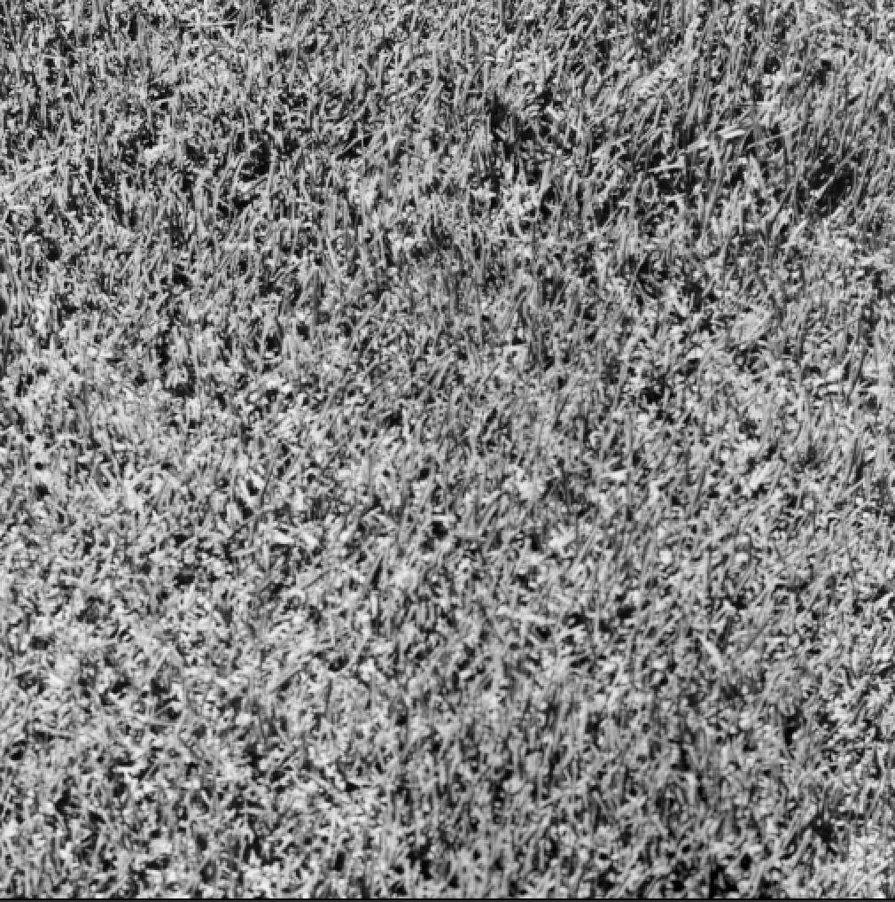
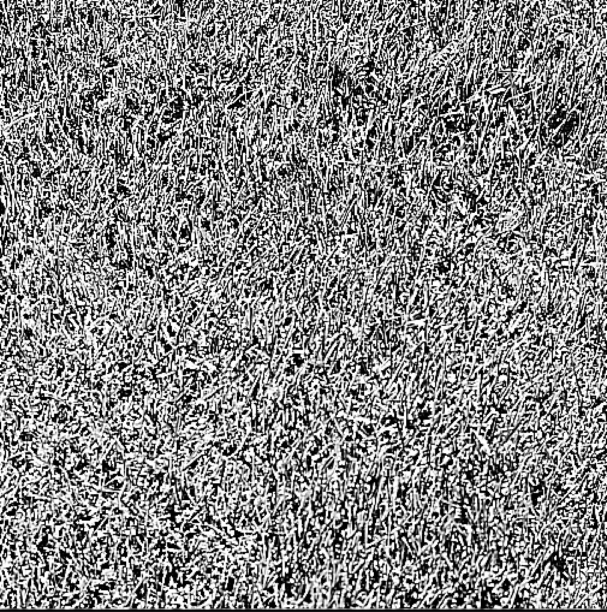

# CUDA Accelerated Box Filter for Texture Image Enhancement

This project applies a CUDA-accelerated box filter to a large set of monochrome texture images from the [USC-SIPI Image Database - Textures Volume](http://sipi.usc.edu/database/database.php?volume=textures). The objective is to demonstrate high-throughput GPU processing of real-world image datasets, with a focus on scalability, performance, and batch automation.

## 🚀 Project Overview

- **Purpose**: Enhance texture images by applying a uniform box filter to reduce noise and improve clarity.
- **Dataset**: 64 TIFF grayscale images  from the USC-SIPI texture collection.
- **Technology**: NVIDIA CUDA, C++14, OpenCV
- **Kernel**: Custom box filter implemented using shared memory for efficiency.

## 🧪 Requirements

- CUDA Toolkit (tested on CUDA 11+)
- OpenCV 4.x (`libopencv-dev`)
- C++14 compiler
- Linux system with NVIDIA GPU (sm_61+ recommended)

Install OpenCV (if not already installed):
```bash
sudo apt-get install libopencv-dev
```


## 🔧 Build Instructions

Compile using the provided `Makefile`:

```bash
make
```

Or manually:
```bash
nvcc -O2 -std=c++14 `pkg-config --cflags opencv4` \
    -Iincludes src/main.cu src/image_utils.cpp \
    -o textures_cuda `pkg-config --libs opencv4` -lcudart
```


## ▶️ Usage

Run the binary and specify the image folder and output path:

```bash
./textures_cuda <input_folder> <output_folder> <filter_width>
```

**Example:**

```bash
./textures_cuda textures outputs 5
```

- `input_folder`: Path to folder with `.tiff` texture images
- `output_folder`: Where to save processed images
- `filter_width`: Size of the box filter kernel (must be odd, e.g., 3, 5, 7)

You can also use the helper script:

```bash
bash run.sh
```

## 📷 Dataset Download

The images are from the [USC-SIPI Textures Volume](http://sipi.usc.edu/database/database.php?volume=textures). Download the zip or tar:

```bash
wget http://sipi.usc.edu/database/zip/textures.zip
unzip textures.zip -d textures/
```


## ✅ Proof of Execution

A sample set of before-and-after `.tiff` images, processing logs, and batch summaries are included.

Examples:

| Original Image | Filtered Image |
|----------------|----------------|
|  | |
| `images/1.1.01.tiff` | `output/1.1.01.tiff` |


---

Made by [Aditi Saxena](https://github.com/aditiisaxena)
